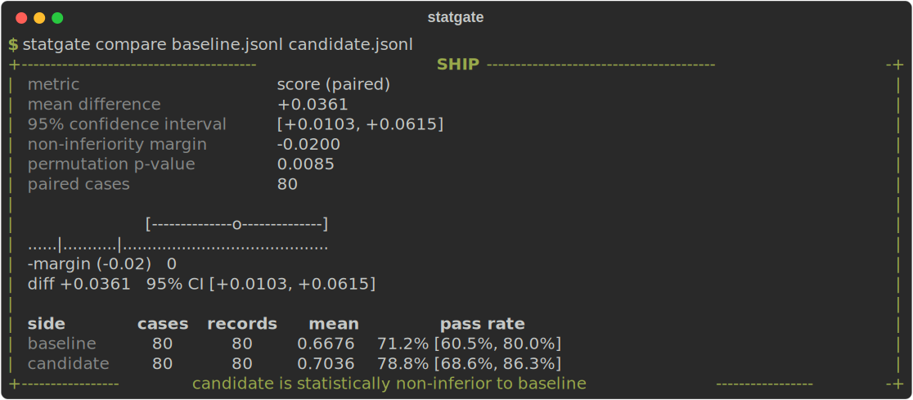
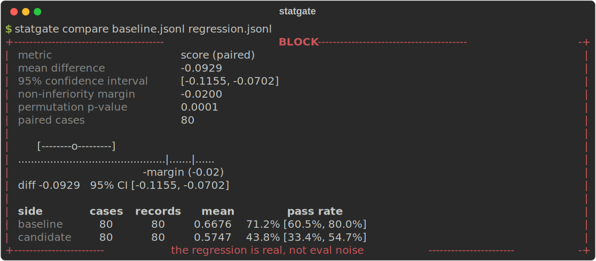
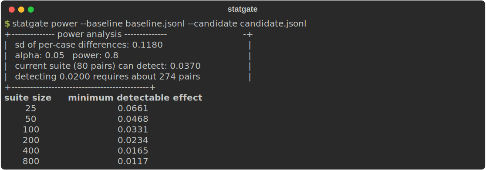
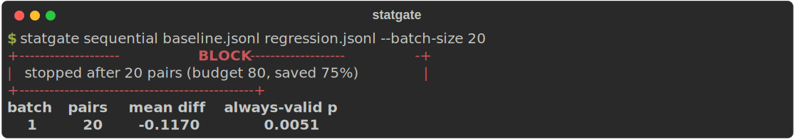

# statgate

**Statistically calibrated ship or block CI gates for LLM evals.**

[](https://github.com/yashchimata/statgate/actions/workflows/ci.yml)
[](https://pypi.org/project/statgate/)
[](pyproject.toml)
[](LICENSE)

Your eval gate is lying to you. A 2 point score drop on a 50 case suite is
almost always sampling noise, but a threshold gate treats it as a regression.
So teams either block merges on coin flips or learn to ignore the red X,
which is worse. LLM outputs are nondeterministic, eval suites are small, and
a raw pass rate comparison cannot tell signal from noise.

statgate is the statistics layer between your eval runner and your merge
button:



| Verdict | Exit code | Meaning |
|---|---|---|
| `SHIP` | 0 | The candidate is statistically non-inferior to the baseline. |
| `BLOCK` | 1 | The regression is real. This is not noise. |
| `INCONCLUSIVE` | 2 | The suite is too small to tell, and statgate reports how many cases you would need. |

Operational failures (bad files, bad flags) exit with code 3, so your
pipeline can always distinguish "the gate decided" from "the gate broke".

statgate makes no LLM calls, sends no network requests, and depends only on
numpy, click, rich, and pydantic. It works with any eval runner that can
produce a results file.

## Install

```bash
pip install statgate
```

Or straight from the repository:

```bash
pip install git+https://github.com/yashchimata/statgate
```

## Sixty second tour

The repository ships example data, so every command below works on a fresh
clone.

**1. Gate a change.** Pair the runs by case id, bootstrap the difference,
decide:

```bash
statgate compare examples/baseline.jsonl examples/candidate.jsonl
```

That is the SHIP screenshot above. Against a genuinely regressed run the
same command blocks, and the error bar shows why: the entire confidence
interval sits left of the margin.



**2. Learn what your suite can actually detect.** Most eval suites cannot
support the margins their owners believe in. This command replaces that
argument with arithmetic:

```bash
statgate power --baseline examples/baseline.jsonl --candidate examples/candidate.jsonl
```



**3. Stop paying for eval cases you do not need.** Sequential mode applies
always-valid stopping boundaries, so clear verdicts end early. Here the
regression is caught after 20 of 80 cases, saving 75% of the eval spend:

```bash
statgate sequential examples/baseline.jsonl examples/regression.jsonl --batch-size 20
```



Sequential mode can also drive your eval command live, batch by batch, with
`--run "python run_eval.py --offset {start} --limit {count}"`.

**4. Sanity check any results file** with `statgate validate results.jsonl`.

## Use it as a pull request gate

```yaml
jobs:
  eval-gate:
    runs-on: ubuntu-latest
    permissions:
      pull-requests: write
    steps:
      - uses: actions/checkout@v7
      - name: Run evals
        run: ./run_evals.sh   # produces baseline.jsonl and candidate.jsonl
      - uses: yashchimata/statgate@v0.1.0
        with:
          baseline: baseline.jsonl
          candidate: candidate.jsonl
```

The action posts a sticky comment with the verdict and error bars, updates
it in place on every push, writes the report to the job summary, and fails
the check only on BLOCK (or on INCONCLUSIVE if you set
`fail-on-inconclusive: true`).

**See it live:** this repository gates its own example evals on every pull
request. The [open demo pull requests](https://github.com/yashchimata/statgate/pulls?q=is%3Apr+is%3Aopen+label%3Ademo)
show a real SHIP comment and a real BLOCK with a failed check.

All inputs and baseline strategies (re-run on main, cached artifact,
committed baseline) are covered in [docs/github-action.md](docs/github-action.md).

## Input formats

statgate ingests results files, not eval frameworks. The format is detected
from the file, or forced with `--adapter`.

**JSON Lines** (one record per line):

```json
{"case_id": "q-001", "score": 0.83, "passed": true}
{"case_id": "q-002", "score": 0.41, "passed": false, "run_index": 0}
```

`case_id` identifies the test case and must match between baseline and
candidate; the paired analysis it enables typically needs 3 to 10 times
fewer cases than an unpaired comparison for the same certainty. Either
`score` or `passed` is required. Repeated runs of the same case
(`run_index`) are averaged per case, so they are never mistaken for
independent samples. Unknown fields are kept as metadata. A JSON array of
the same objects and a CSV with the same columns both work.

**promptfoo**: point statgate at the file written by
`promptfoo eval -o results.json`. Case ids are derived from test and prompt
indices, so two exports of the same suite pair cleanly.

Missing your runner's format? Adapters are about 50 lines;
[open an adapter request](https://github.com/yashchimata/statgate/issues/new?template=adapter_request.yml)
with a sample file.

## Python API

Everything the CLI does is available as a typed library:

```python
from pathlib import Path

from statgate import GateSettings, Verdict, evaluate_gate
from statgate.adapters import load_records

baseline = load_records(Path("baseline.jsonl"))
candidate = load_records(Path("candidate.jsonl"))
report = evaluate_gate(baseline, candidate, GateSettings(margin=0.02, seed=42))

print(report.verdict, report.interval.low, report.interval.high)
if report.verdict is Verdict.BLOCK:
    raise SystemExit(1)
```

`report` carries the interval, p-value, per-side summaries, and the suite
size needed when the verdict is INCONCLUSIVE, so you can build custom
policies in a pytest fixture or anywhere else.

## Configuration

statgate reads `statgate.toml` from the working directory, or from
`--config path`. The most common values can also be overridden with CLI
flags such as `--margin`, `--alpha`, `--metric`, and `--seed`.

```toml
[gate]
metric = "score"        # or "pass_rate"
alpha = 0.05            # significance level; confidence is 1 - alpha
margin = 0.02           # regression size you are willing to tolerate
power = 0.8             # target power for suite size recommendations
resamples = 10000       # bootstrap resamples
permutations = 10000    # permutation test iterations
seed = 42               # set for fully reproducible reports

[sequential]
batch_size = 25
max_cases = 400
```

The margin is the heart of the policy. `margin = 0.02` means "block only
when we are confident the candidate is more than 2 points worse". A margin
of zero demands proof of strict improvement, which small suites can rarely
provide. Full reference in [docs/configuration.md](docs/configuration.md).

## How the statistics work

Short version: per-case paired differences, a BCa bootstrap confidence
interval on their mean, a sign-flip permutation test as a cross-check, a
non-inferiority decision rule, normal-approximation power analysis, and a
mixture SPRT for always-valid sequential stopping. Cases are the resampling
unit, so repeated runs of the same case are never mistaken for independent
evidence.

The long version, with the reasoning behind each choice and the known
limitations, is in [docs/methodology.md](docs/methodology.md). The test
suite includes calibration checks that verify interval coverage and false
positive rates against synthetic data with known ground truth, including
under sequential optional stopping.

## Development

```bash
git clone https://github.com/yashchimata/statgate
cd statgate
python -m venv .venv && . .venv/bin/activate   # .venv\Scripts\activate on Windows
pip install -e ".[dev]"
pytest
ruff check src tests
mypy src
```

Contributions are welcome, especially new adapters. See
[CONTRIBUTING.md](CONTRIBUTING.md) and the
[good first issues](https://github.com/yashchimata/statgate/issues?q=is%3Aissue+is%3Aopen+label%3A%22good+first+issue%22).

## License

[MIT](LICENSE)
